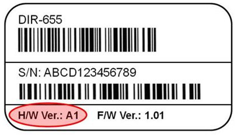

- [Sources](#sources)
- [Things to know](#things-to-know)
- [1. Find your chipset](#1-find-your-chipset)
- [2. Kernel](#2-kernel)
- [3. Download & Install chipset driver](#3-download--install-chipset-driver)
- [Example](#example)
	- [Drivers found](#drivers-found)

## Sources

- [Source 1](https://www.fastoe.com/blog/install-rtl8812bu-usb-wifi-dongle-on-linux)
- [Source 2](https://bbs.archlinux.org/viewtopic.php?pid=1941767)
- [Source 3](https://www.reddit.com/r/archlinux/comments/amqua3/trying_to_get_the_a_usb_wifi_adapter_running/)
- [Source 4](https://askubuntu.com/questions/1288547/rtl88x2bu-driver-for-new-kernel-version)

## Things to know

> If you update the kernel, some drivers may become incompatible
> 
> In the other hand, if you have a too updated kernel, some drivers may not work
> 
> kernel and kernel-headers must match
> 
> on upgrade or downgrade remember to reboot

## 1. Find your chipset

```bash
lsusb -v
# searc for vendor ID
```
http://en.techinfodepot.shoutwiki.com/wiki/D-Link_DWA-182_rev_D1:
- [PCI vendor ID List Repository](https://pci-ids.ucw.cz/read/PC/)
- [USB vendor ID List Repository](https://usb-ids.gowdy.us/read/UD)

**Or much better check the vendor's site**

[for me dlink.com](https://support.dlink.com/ProductInfo.aspx?m=DWA-182)

## 2. Kernel

check kernel version
```bash
# kernel
uname -srn
# kernel headers
sudo pacman -Qi linux-headers
sudo pacman -Qi linux-lts-headers
```

## 3. Download & Install chipset driver

- sudo make dkms_install
- sudo make && sudo make install

## Example

Mine is an DWA-182 AC1300 MU-MIMO Wi-Fi USB Adapter.<br>
It's an AC1200 but powerful as written [here](https://us.dlink.com/en/products/dwa-182-ac1300-mu-mimo-wi-fi-usb-adapter)<br>
And his version is D1 <br>

**Where to find the hardware versione:**<br>


At the bottom of [this page](https://eu.dlink.com/it/it/products/dwa-182-wireless-ac1200-dual-band-usb-adapter?revision=deu_revd#downloads) I found them with some more specifics!!<br>

This is what they suggest: RTL88x2BU

```diff
Driver Linux 5.8.7.1 RevD1		-> driver version 	
Driver for Linux 2.6.24 ~ 5.3	-> kernel version supported
- but I got 5.4.85-1-lts...
```

There are also these drivers [here](https://aur.archlinux.org/packages/?O=0&SeB=nd&K=RTL88x2BU&outdated=&SB=n&SO=a&PP=50&do_Search=Go)

### Drivers found

| Source | Version | Date | kernel supported |
| --- | --- | --- | --- |
| Arch AUR | rtl88x2bu-dkms-git | 2020-08-02 | dunno |
| D-Link Site | RTL88x2BU_WiFi_linux_v5.8.7.1 RevD1 | 2020-06-22 | Linux 2.6.24 ~ 5.3 |

In https://github.com/aircrack-ng repo there are some drivers but not the rtl88x2bu version. So I'll stick with what the vendor's site says and I'll downgrade my kernel to 5.3.


