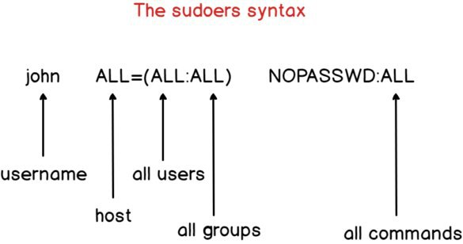

<<<<<<< HEAD
## ...

=======
>>>>>>> 525d79aad2ad37bfe9ed0946cd445f6cc74aa1c8
1. https://wiki.archlinux.org/index.php/Installation_guide
2. https://wiki.archlinux.org/index.php/General_recommendations

### Date, Time, System Clock
```
$ timedatectl
    > status
    > list-timezones
    > set-timezone <name>
    > set-ntp true
$ sudo hwclock --show
```
<<<<<<< HEAD

## Useful links

[Where PATH is setted?](https://stackoverflow.com/questions/37676849/where-is-path-variable-set-in-ubuntu)
=======
## Pacman

```bash
pacman -Syu
pacman -Ql packagename
```

## Sudo


>>>>>>> 525d79aad2ad37bfe9ed0946cd445f6cc74aa1c8
